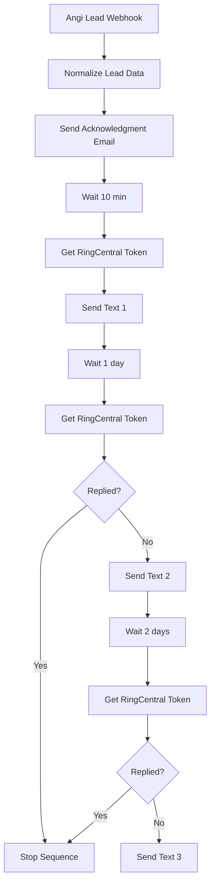

[README.md](https://github.com/user-attachments/files/29214412/README.md)
# Angi Lead → Email + SMS Follow-Up Automation (n8n)

An end-to-end lead-response workflow for a moving company. When a new lead arrives from **Angi**, the workflow instantly acknowledges the customer by email, then runs a multi-day SMS follow-up sequence through **RingCentral** — automatically stopping the texts the moment the lead replies.

Built in [n8n](https://n8n.io/). The entire pipeline lives in a single importable workflow file.

---

## What it does

1. Receives a new Angi lead via webhook.
2. Parses and normalizes the lead's contact and move details.
3. Sends an immediate, personalized acknowledgment email (the priced quote is sent separately by a rep from the CRM).
4. Sends a 3-message SMS follow-up sequence from a RingCentral business number, spaced over ~3 days.
5. Before each follow-up text, checks RingCentral for an inbound reply from the lead — and halts the sequence if they've engaged.

The result: every lead gets a response within seconds, follow-ups run on autopilot, and nobody gets texted after they've already replied.

---

## Architecture

---

## Tech stack

| Component | Role |
|-----------|------|
| **n8n** | Workflow orchestration |
| **Webhook** | Inbound Angi lead capture |
| **Gmail / SMTP** | Acknowledgment email delivery |
| **RingCentral SMS API** | Outbound text follow-ups |
| **RingCentral Message Store API** | Inbound reply detection |
| **JWT (OAuth 2.0)** | Server-to-server RingCentral auth |

---

## How lead data is mapped

Angi delivers leads as JSON. The `Normalize Lead Data` node maps Angi's fields to clean variables used downstream:

| Variable | Source (Angi field) |
|----------|---------------------|
| `firstName` | `firstName` |
| `lastName` | `lastName` |
| `email` | `email` |
| `phone` | `primaryPhone` |
| `phoneE164` | `primaryPhone`, reformatted to `+1XXXXXXXXXX` |
| `movingFrom` | `address` + `city` + `stateProvince` + `postalCode` |
| `movingTo` | `interview[]` answer to "Where are you moving to?" (usually a ZIP) |
| `moveDate` | `interview[]` answer to "When will you be moving?" |
| `moveSize` | `interview[]` answer to "How large is the area you are moving from?" |
| `moveScope` | `interview[]` answer to same-state vs. different-state |
| `customerComments` | `comments` (Angi's boilerplate "no comment" filler is filtered out) |
| `leadReceivedAt` | Timestamp captured at intake, used to scope the reply check |

**Notes on Angi data quirks:**
- Angi provides only the customer's origin address; the destination arrives as a ZIP inside the `interview` array, and is sometimes absent. The email degrades gracefully ("to be confirmed on our call") when a field is missing.
- Angi inserts a canned "Customer did not provide additional comments…" string when there's no real note. The workflow detects and suppresses this so it never echoes filler back to the customer.

---

## Prerequisites

- A running n8n instance (Cloud or self-hosted).
- A Gmail/Google Workspace account (or SMTP credentials) for the acknowledgment email.
- A RingCentral account with an SMS-enabled number.
- A RingCentral developer app (see setup below).
- Completed **A2P 10DLC** brand + campaign registration for the sending number (required for automated SMS to deliver).

---

## Setup

### 1. Import the workflow
In n8n: **Workflows → ⋯ → Import from File** and select the workflow JSON.

### 2. Create the RingCentral developer app
In the [RingCentral Developer Console](https://developers.ringcentral.com/):
- Create a **REST API App**, private to your account.
- Auth type: **JWT auth flow**.
- Scopes: **SMS** and **Read Messages** (Read Messages is required for the reply-detection step).
- Note the **Client ID** and **Client Secret** from the app dashboard.

### 3. Generate the JWT
Under your Developer Console profile → **Credentials → Create JWT**.
- Generate it while logged in as the user/extension that **owns the SMS sending number** — otherwise sends will fail.
- Optionally scope the JWT to this app only.
- Copy the JWT string.

### 4. Add credentials in n8n
- **Gmail OAuth2** credential → assign to the email node.
- **Basic Auth** credential → username = RingCentral **Client ID**, password = **Client Secret**. Assign to all three "Get Token" nodes.
- Paste the **JWT** into the `assertion` body field of all three "Get Token" nodes.

### 5. Set the sending number
The "from" number is configured in each SMS node's JSON body. Replace the placeholder with your RingCentral number in E.164 format (e.g., `+1XXXXXXXXXX`).

### 6. Connect Angi
Activate the workflow and copy the webhook's **Production URL**. Provide it to Angi (or forward Angi lead notifications to it) so leads POST into the workflow.

---

## Compliance

- **A2P 10DLC:** Automated business SMS must be sent from a number registered with a TCR Brand and Campaign. Unregistered 10DLC traffic is blocked by carriers. Register before going live.
- **High Volume SMS:** Standard RingCentral SMS prohibits automated messaging; request High Volume SMS enablement for API-driven sends.
- **Opt-out:** The first message includes "Reply STOP to opt out." Keep opt-out language in any edited copy.

---

## Design decisions

- **Acknowledgment, not quote.** Moving quotes are priced manually by a rep in the CRM, so no priced quote exists when the lead first arrives. The workflow sends an instant acknowledgment to close the speed-to-lead gap; the real quote follows from the rep. This keeps the automation honest and avoids duplicate/empty "quote" emails.
- **Reply detection in n8n, not a separate tool.** Because n8n already sends via the RingCentral API, it also queries the Message Store before each follow-up. This stops the sequence on engagement rather than merely alerting a human — and keeps everything in one system.
- **Fresh token per send.** RingCentral access tokens expire (~1 hour), so the workflow exchanges the JWT for a new token immediately before each text rather than reusing one across multi-day delays.

---

## Known limitations

- The CRM used (Elromco) does not expose public API access on this account, so order creation is handled by the CRM's native Angi integration rather than by n8n. The priced quote is sent manually by a rep.
- Destination data from Angi is ZIP-only and occasionally missing.
- The reply check treats *any* inbound SMS from the lead's number since intake as engagement (intentionally erring toward under-texting).

---

## Testing

1. Activate the workflow and use the webhook **Test URL** with a sample Angi payload (e.g., via Postman).
2. Confirm the acknowledgment email fires and fields render correctly.
3. Confirm Text 1 sends ~10 minutes later (or shorten the wait for testing).
4. To verify the reply-stop, send an inbound text from the test number before the next follow-up and confirm the sequence halts.

> Tip: point the token/SMS nodes at `platform.devtest.ringcentral.com` with sandbox credentials to test without sending live messages, then switch to `platform.ringcentral.com` for production.

---

## License

MIT — adapt freely.
